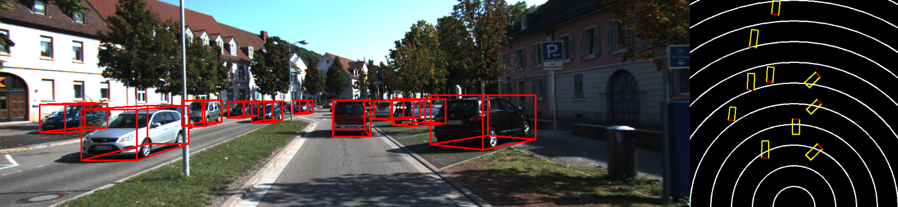
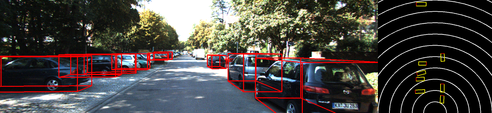
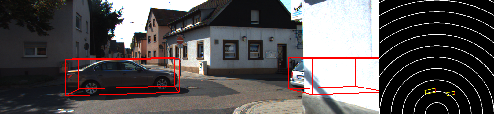
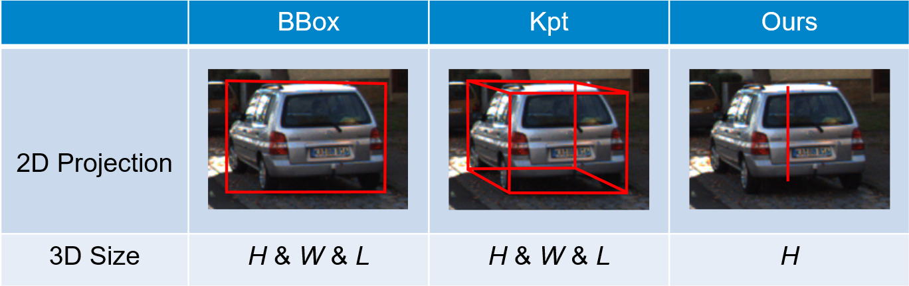

# MonoRCNN
MonoRCNN is a monocular 3D object detection method for automonous driving, published at ICCV 2021. This project is an implementation of MonoRCNN.

## Related Link
* [Video demo (KITTI)](https://www.youtube.com/watch?v=46lToJSagcg)
* [Paper (ICCV 2021)](https://arxiv.org/abs/2104.03775)
* [KITTI benchmark (ICCV 2021)](http://www.cvlibs.net/datasets/kitti/eval_object_detail.php?&result=06e0aacbeb8de57a09d2a3557907064aa501048f)

## Visualization




## Distance Decomposition


## Installation

* Python 3.6
* PyTorch 1.5.0 
* Detectron2 0.1.3 

Please use the Detectron2 included in this project. To ignore fully occluded objects during training, [`build.py`](detectron2/data/build.py#L55), [`rpn.py`](detectron2/modeling/proposal_generator/rpn.py#L292), and [`roi_heads.py`](detectron2/modeling/roi_heads/roi_heads.py#L272) have been modified.

## Dataset Preparation
* [KITTI](projects/KITTI/README.md)

## Model & Training Log
* [KITTI val1 split](https://drive.google.com/file/d/1syKiGoEa_qhNgqdWZEEivPdlAOzYxK9G/view?usp=sharing)

Organize the downloaded files as follows:
```
├── projects
│   ├── MonoRCNN
│   │   ├── output
│   │   │   ├── model
│   │   │   ├── log.txt
│   │   │   ├── ...
```

## Test
```
cd projects/MonoRCNN
./main.py --config-file config/MonoRCNN_KITTI.yaml --num-gpus 1 --resume --eval-only
```
Set [`VISUALIZE`](projects/MonoRCNN/config/MonoRCNN_KITTI.yaml#L13) as `True` to visualize 3D object detection results (saved in `output/evaluation/test/visualization`).

## Training
```
cd projects/MonoRCNN
./main.py --config-file config/MonoRCNN_KITTI.yaml --num-gpus 1
```

## Citation
If you find this project useful in your research, please cite:

```
@inproceedings{MonoRCNN_ICCV21,
    title = {Geometry-based Distance Decomposition for Monocular 3D Object Detection},
    author = {Xuepeng Shi and Qi Ye and 
              Xiaozhi Chen and Chuangrong Chen and 
              Zhixiang Chen and Tae-Kyun Kim},
    booktitle = {ICCV},
    year = {2021},
}
```

## Contact
x.shi19@imperial.ac.uk

## Acknowledgement
* [Detectron2](https://github.com/facebookresearch/detectron2)
* [M3D-RPN](https://github.com/garrickbrazil/M3D-RPN)
* [MMDetection](https://github.com/open-mmlab/mmdetection)
